# newhiwoong.github.io

 [jekyll-theme](https://github.com/topics/jekyll-theme), [github-pages-examples](https://github.com/collections/github-pages-examples)등에서 원하는 테마를 선택하고 블로그 제작을 진행하면 된다.
 
 일단 [이 블로그](https://github.com/newhiwoong/newhiwoong.github.io)를 자신의 블로그로 만드는 방법을 설명하겠다.
 
## 블로그 Code 다운로드
먼저 자신이 블로그를 만들 상위 Directory에서 Git를 킨다. Git이 설치되지 않은 사람은 [Git install](https://git-scm.com/book/ko/v2/%EC%8B%9C%EC%9E%91%ED%95%98%EA%B8%B0-Git-%EC%84%A4%EC%B9%98)이 링크를 보고 설치를 하자.

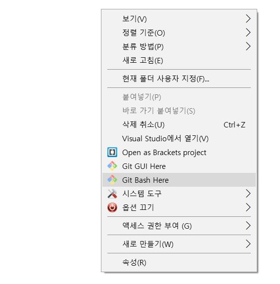


Windows의 경우 마우스 오른쪽 클릭을 하여 Git Bash Here를 통해 Git을 열고 Mac이나 linux의 경우 terminal 창에서 아래 코드를 실행한다.

```
git init
git clone https://github.com/newhiwoong/newhiwoong.github.io.git
cd newhiwoong.github.io/
```
---

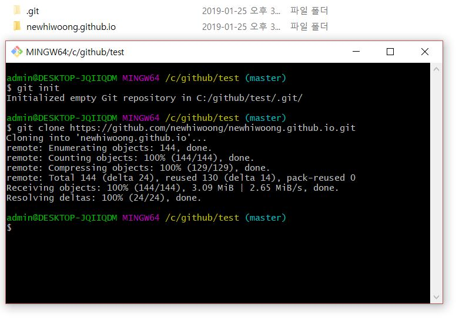

그러면 위 사진처럼 새로운 폴더가 생기고 Code 설치가 될 것이다.

## Github 제작
다음으로 자신의 블로그를 올릴 github를 제작해야 한다. `username.github.io`라는 repository를 생성한다. username은 아래 사진과 같이 `Owner`아래에 username이 나온다. 예를 들어 자신의 username이 juliuds라고 치면 아래 사진과 같이 `juliuds.github.io`를 이름으로 Create repository를 하면 된다.

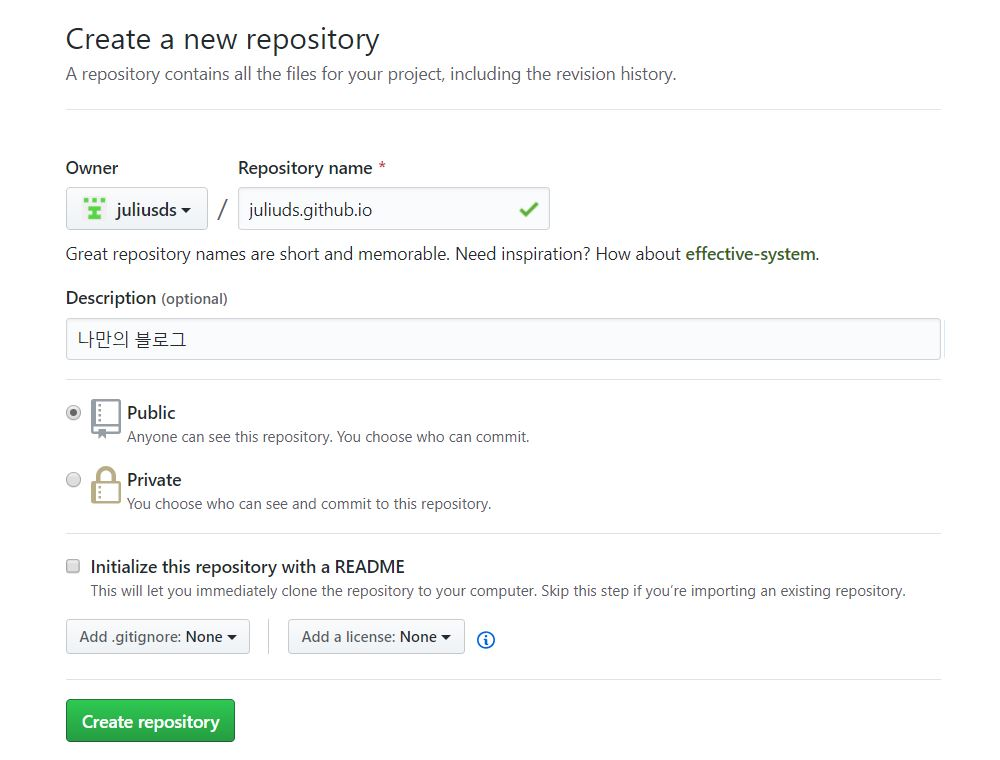

## 정보변경
clone 한 블로그의 code를 올린다면 자신의 블로그가 아니고 남의 블로그다. 그렇기 때문에 자신의 정보에 맞게 수정을 할 필요가 있다. 앞으로 수정할 때 사용할 에디터는 [brackets](http://brackets.io/)이다. 좋아하는 에디터가 없다면 링크에 들어가서 설치하면 된다.

### Post 제거
`_posts` 폴더에 들어가서 기존에 있는 post들을 전부 삭제한다. 남의 post를 자신의 블로그에 올릴 필요는 없지 않은가?

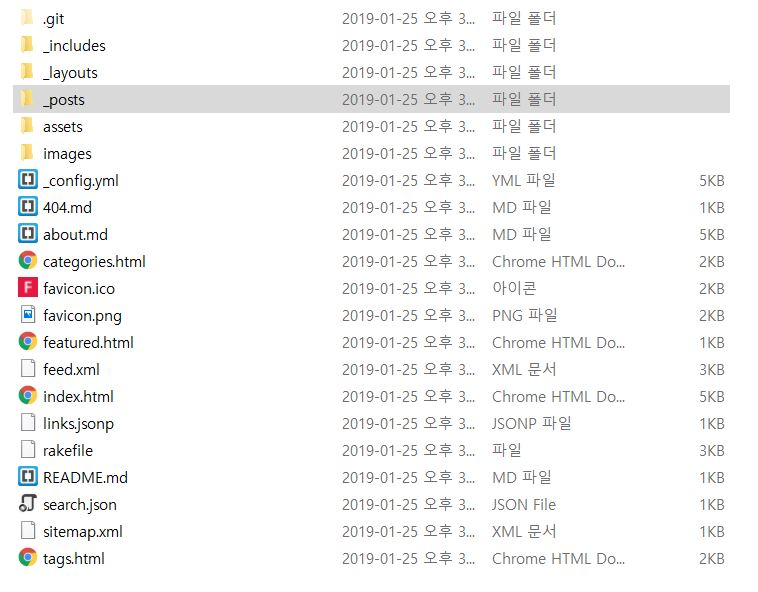

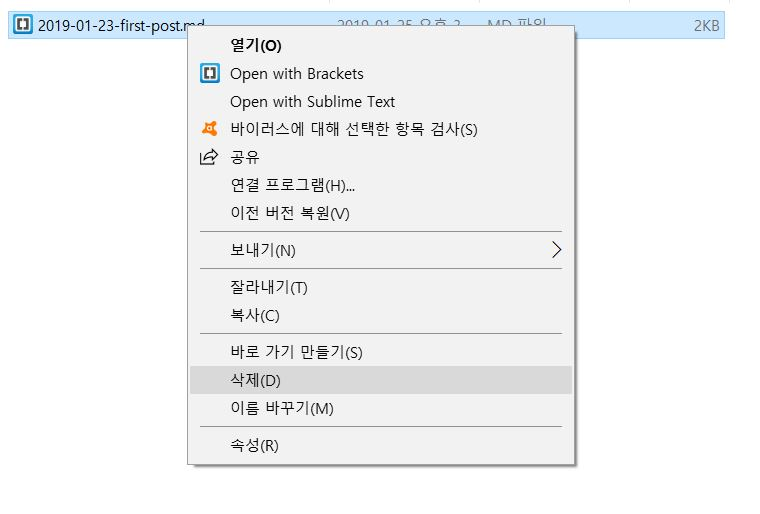

### Post 추가
그래도 기본으로 1개의 post는 필요하니 `_posts` 폴더에 [Code](https://github.com/hmfaysal/Notepad/edit/gh-pages/_posts/2014-07-23-why-jekyll.md) 내용을 복사 붙여넣기를 하거나 직접 하나를 만들자. 파일의 형식은 yyyy-mm-dd-제목.md 형식으로 post를 올리자.

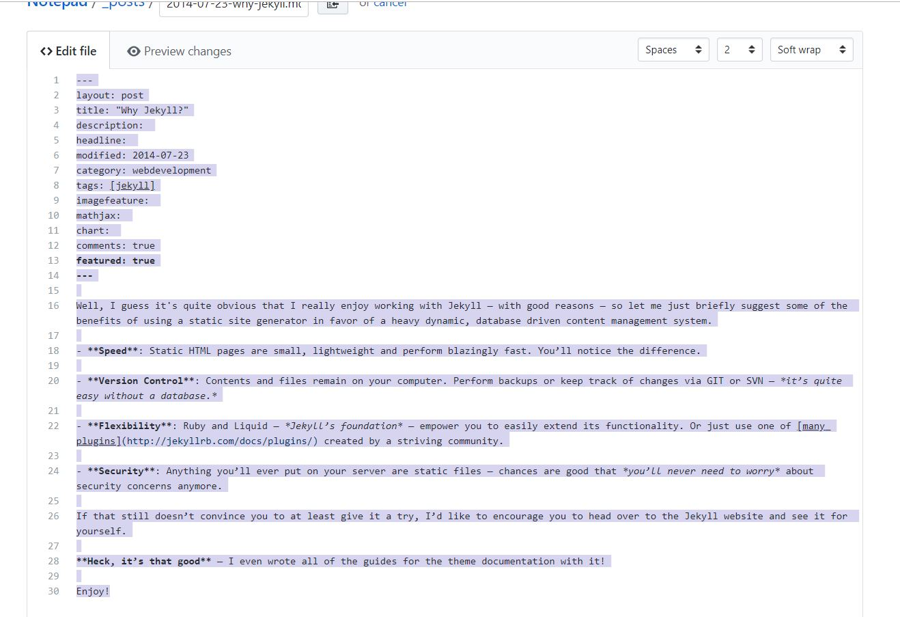

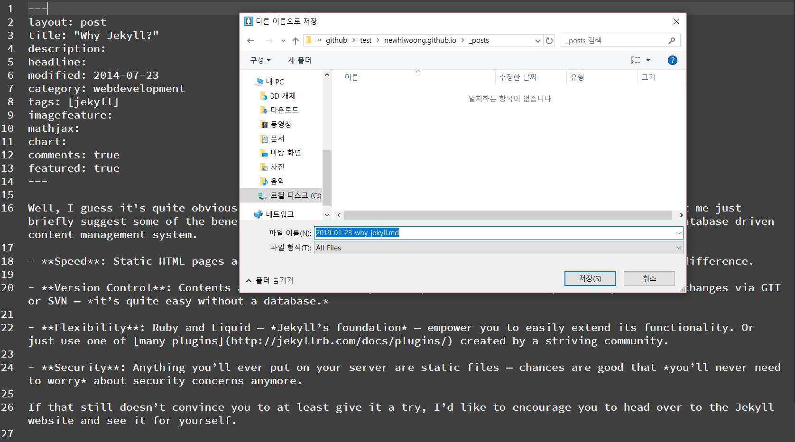

#### Post 제작 방법
```
---
layout: post
title: "개인 블로그1 : 시작 계기" #post의 제목
description:         
headline: 
modified: 2019-01-23           #post의 날짜
category: webdevelopment       #post의 카테고리
tags: [jekyll]                 #post의 태그
imagefeature: cover10.jpg      #post의 앞에 나오는 사진
mathjax: 
chart: 
comments: true                 #post의 댓글 사용 여부
share: true                    #post의 댓글 공유가능 여부
featured: true                 #post가 중요한 글인지 여부
---
```
---
위 방식대로 post의 시작 부분을 수정하여 사용하자.

## 설정(config) 변경
`_config.yml`파일을 수정하는 것이 필요하다. 

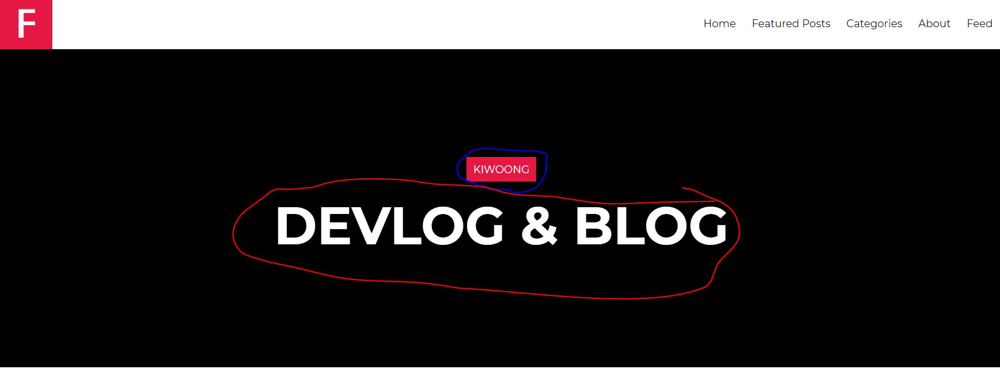  

위에 사진에 파란색과 빨간색으로 동그라미를 친 부분이 아래에서 해당 부분에 맞춰준다.

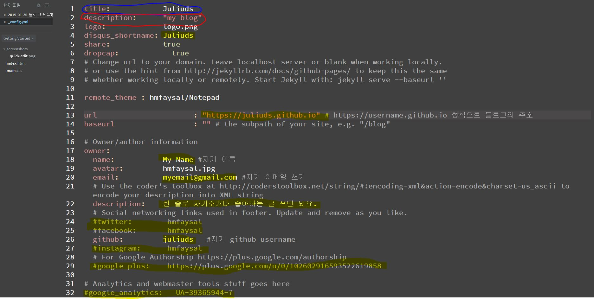  

형광펜으로 쓴 부분들을 바꾸면 된다. `#`으로 한글로 주석을 쓴 것들을 참고 자신에게 맞게끔 만들 수 있다. 또한 아랫부분은 twitter, facebook, instagram, google_plus가 있다면 주석을 지우고 자신의 닉네임을 쓰자.

```
#twitter:        hmfaysal
#facebook:       hmfaysal
github:         juliuds   #자기 github username
#instagram:      hmfaysal
# For Google Authorship https://plus.google.com/authorship
#google_plus:    https://plus.google.com/u/0/102602916593522619858
```
---

그리고 아랫부분은 자신의 블로그 주소를 적는 것으로 특히 중요하다.  
`url                      : "https://juliuds.github.io" # https://username.github.io 형식으로 블로그의 주소`

## 자기소개 수정
블로그의 `about`페이지는 `about.md`파일로 이뤄진다. 

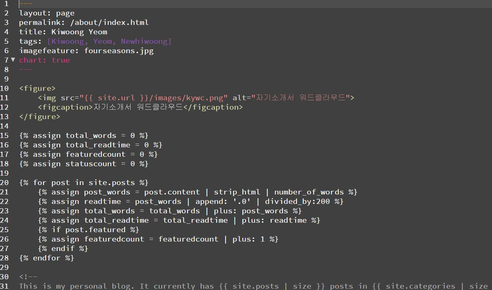  

`about.md`파일을 자기 자신을 소개하는 글과 그림들로 바꾸자.

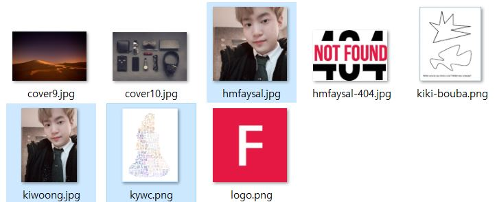  

특히 `kiwoong.jpg`, `kywc.png`, `hmfaysal.jpg`파일들은 자기 자신을 표현하는 이미지로 변경하자.

## 블로그 올리기
이제 위에 설정이 완료됐으니 블로그를 올려보자.

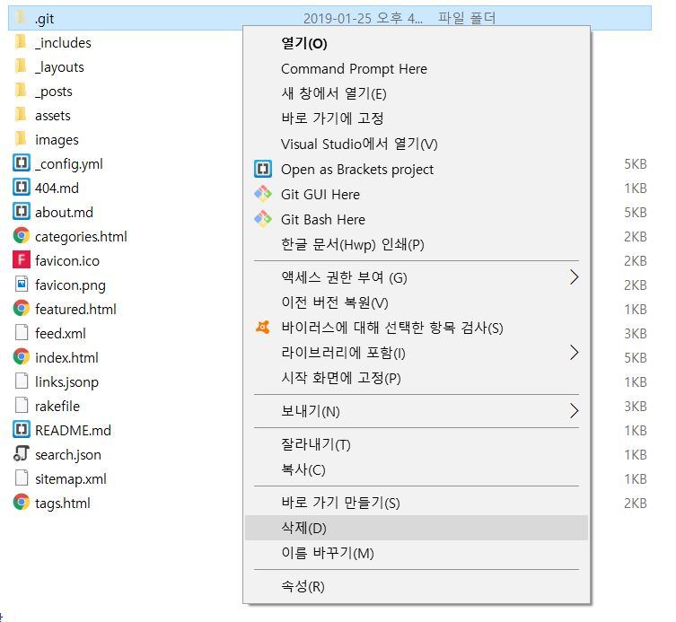  

올리기 전에 `.git`파일은 삭제하자.

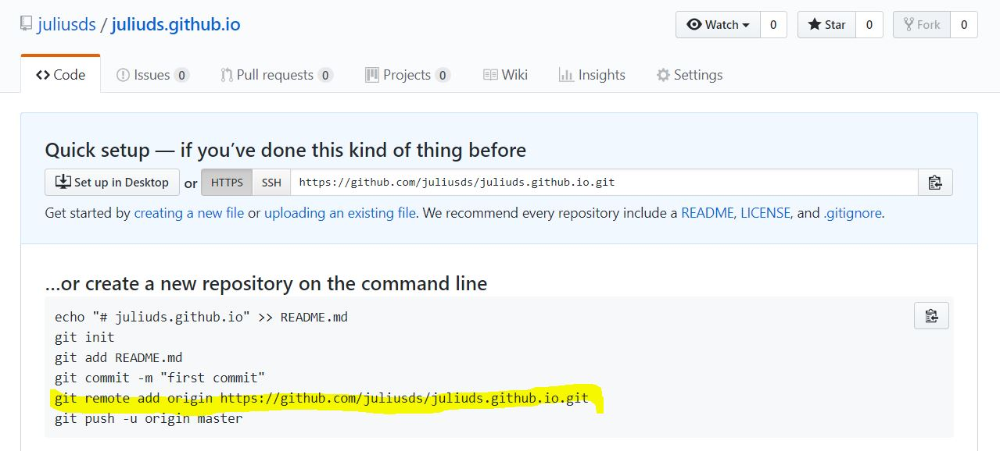  

Github 제작에서 만든 페이지를 참고해서 제작하면 된다.

```
git init
git add *
git commit -m "first commit"
git remote add origin https://github.com/juliusds/juliuds.github.io.git
git push -u origin master
```
---

`git remote add origin https://github.com/juliusds/juliuds.github.io.git` 이 부분은 형광펜으로 칠한 부분으로 즉, 자신의 repository 경로로 작성한다.

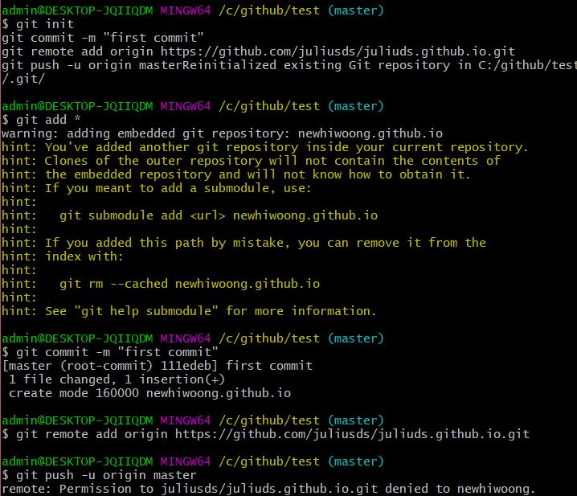  
windows 이미지

  
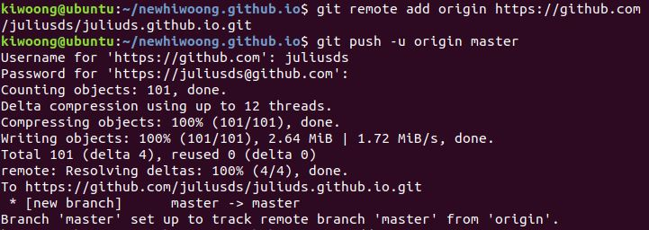  
Ubuntu에서 잘 됐을 때 예시

이렇게 해서 블로그 올리기를 성공하였다. 그럼 이제 https://username.github.io 형식의 자신의 블로그를 chrome 등 브라우저로 실행해서 보자.

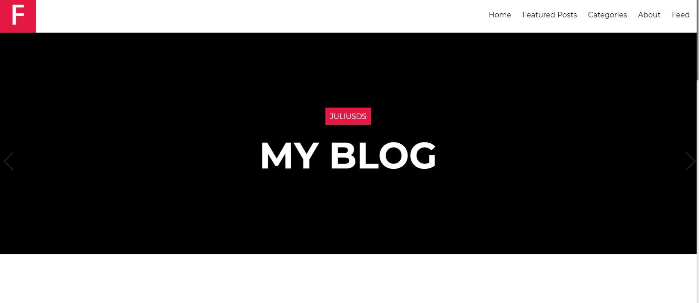  

## 댓글 기능 추가
Disqus를 이용해서 블로그에 댓글 기능을 추가할 겁니다.

먼저 [disqus 로그인](https://disqus.com/profile/login/) 혹은 회원가입을 하자, 만약 Google 계정 등이 있다면 더 간단하게 회원가입을 할 수 있다.

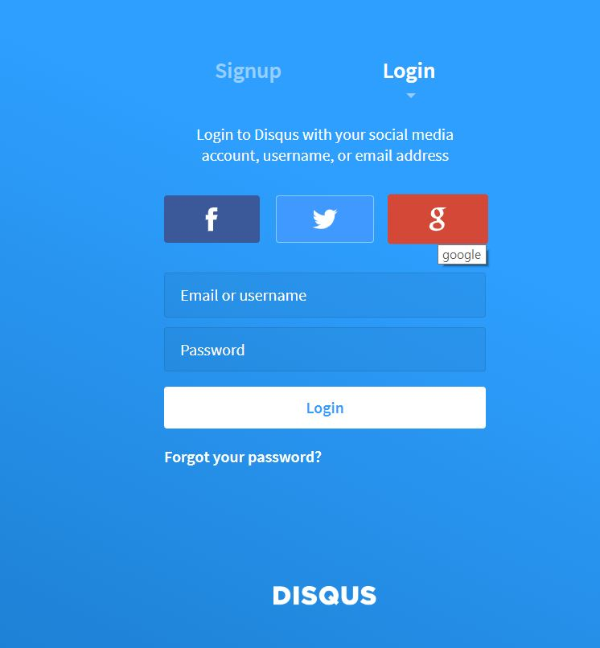  

그리고 왼쪽 위에서 Setting에 들어가 필요한 정보들을 기재한다.

  
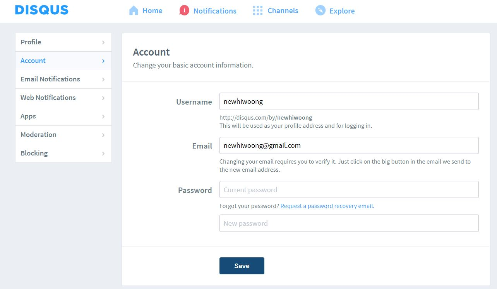  

그리고 다시 [Disqus 사이트](https://disqus.com/)로 들어와서 GET STARTED를 클릭하고

  

`I want to install Disqus on my site` 버튼을 클릭하여 댓글 기능 추가를 시작한다.

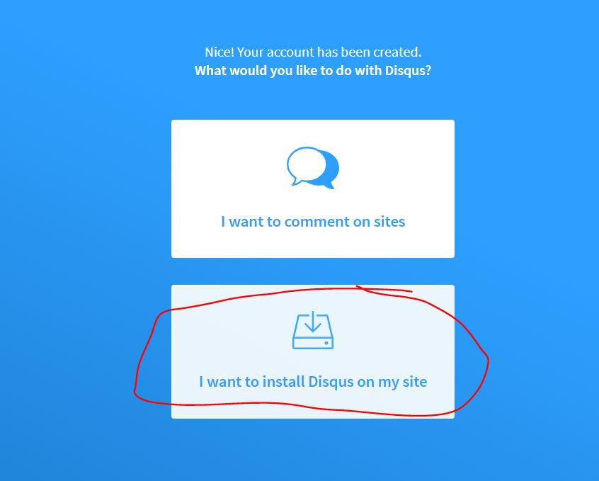  

그리고 Website Name, Category를 지정하고 `Create Site`를 클릭한다.

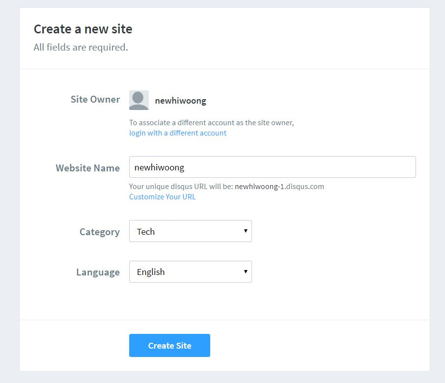  

나는 돈이 없기에 Basic 즉 공짜인 것을 선택했다. 돈이 있다면 다른 기능으로 사는 것도 좋을 거 같다.

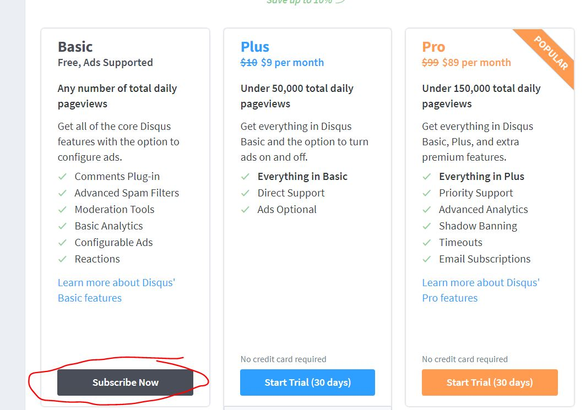  

이 사이트는 `Jekyll` 기반의 사이트이므로 `Jekyll`을 선택한다.

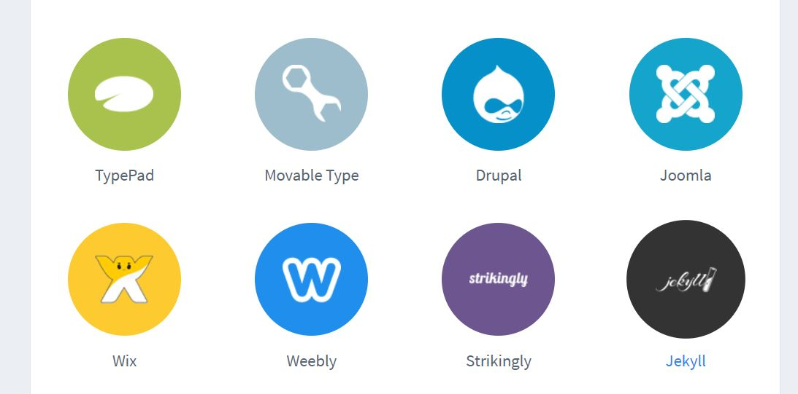  

그리고 스크롤을 조금 내려서 `Universal Embed Code`를 누르고 

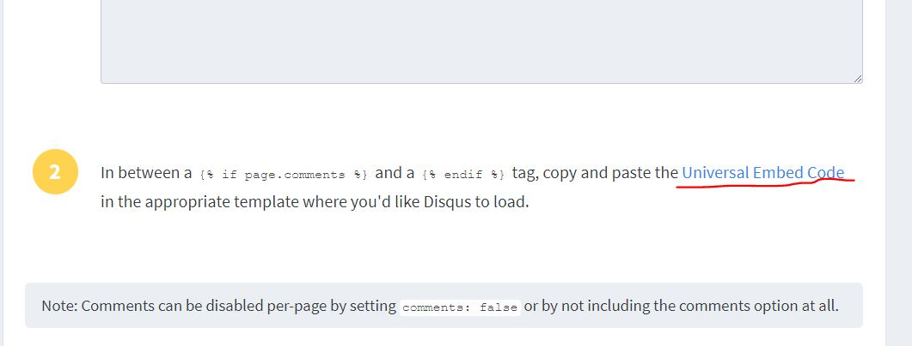  

모든 내용을 복사해서 `ctrl + a` + `ctrl + c` `_includes` 폴더에 `disqus_comments.html` 파일에 붙여넣기 `ctrl + v`를 하고 

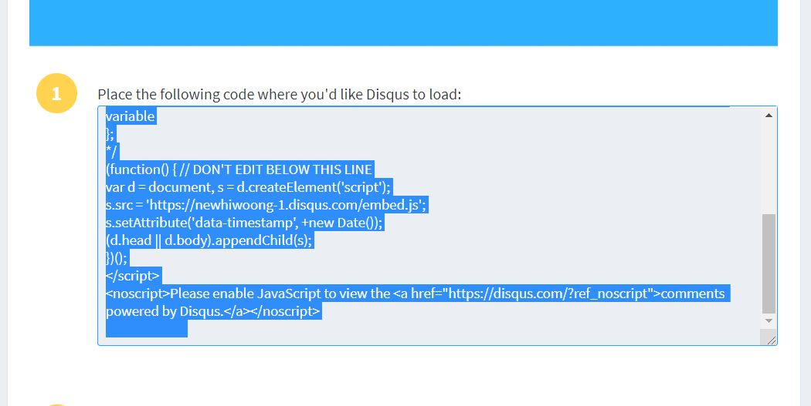  
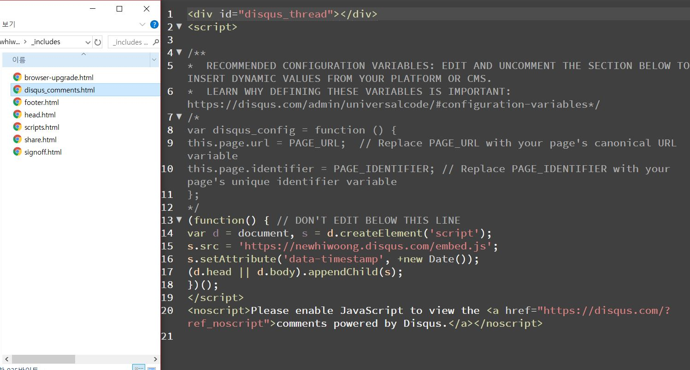  

`git pull`을 진행하면 아래와 같이 댓글을 쓸 수 있다.

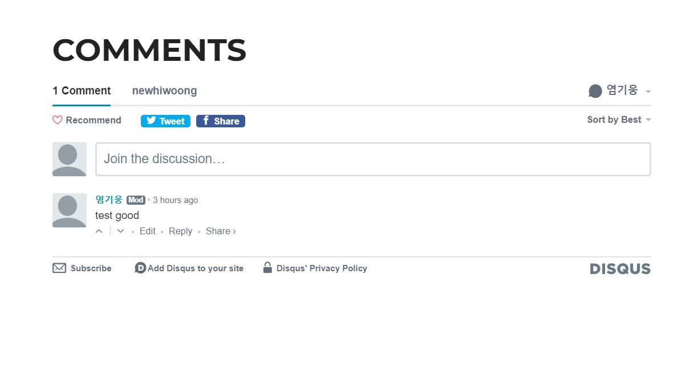  

이제 자신만의 블로그를 마음껏 즐기길 바란다.

## Base code
> https://github.com/hmfaysal/Notepad